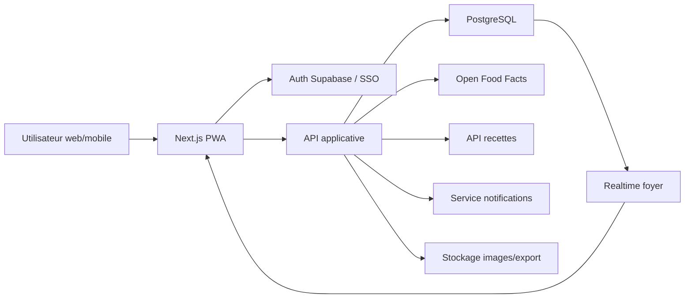
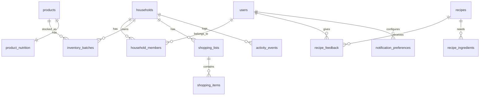

# Architecture projet et BDD - EcoFoodStock

## 1. Decision d'architecture

Pour EcoFoodStock, le choix recommande est une architecture web responsive/PWA, avec une base solide pour evoluer ensuite vers une app mobile native si besoin.

Stack proposee pour le MVP :

- Frontend : Next.js + React + TypeScript
- UI : Tailwind CSS + shadcn/ui + lucide-react
- Backend : API routes / server actions Next.js pour le MVP
- Base de donnees : PostgreSQL
- Plateforme pratique : Supabase pour Auth, Postgres, Realtime, Storage et Row Level Security
- Realtime : Supabase Realtime pour inventaire et liste de courses partages
- Notifications : Web Push / Firebase Cloud Messaging selon cible mobile
- Jobs planifies : cron server-side pour alertes DLC et bilans hebdomadaires
- APIs externes :
  - Open Food Facts pour scan produit
  - Spoonacular ou Edamam pour recettes

Cette architecture evite de construire trop tot un backend lourd, tout en gardant une BDD relationnelle propre. Si le projet grossit, on peut extraire le backend vers NestJS sans changer profondement le modele de donnees.

## 2. Vue d'ensemble



## 3. Domaines metier

L'application doit etre decoupee par domaines :

- Authentification et onboarding
- Foyer partage
- Profil utilisateur et objectifs nutritionnels
- Catalogue produits
- Inventaire alimentaire
- Recettes et preferences
- Courses
- Historique / tracabilite
- Sante et statistiques
- Notifications
- Confidentialite et export

## 4. Structure frontend recommandee

```text
src/
  app/
    (auth)/
      login/
      register/
      forgot-password/
    onboarding/
    dashboard/
    inventory/
    recipes/
    health/
    shopping/
    history/
    settings/
  components/
    ui/
    layout/
    inventory/
    recipes/
    health/
    shopping/
    history/
    settings/
  features/
    auth/
    onboarding/
    household/
    inventory/
    products/
    recipes/
    health/
    shopping/
    history/
    notifications/
  lib/
    supabase/
    api/
    validators/
    dates/
    nutrition/
  types/
```

Principe :

- `app/` contient les routes et pages.
- `components/` contient les composants visuels reutilisables.
- `features/` contient la logique metier par domaine.
- `lib/` contient les clients techniques, helpers et validations.
- `types/` contient les types partages.

## 5. Structure backend/API recommandee

Pour le MVP, les endpoints peuvent vivre dans Next.js :

```text
src/app/api/
  products/
    scan/
    search/
  inventory/
    add/
    consume/
    waste/
    update-quantity/
  recipes/
    suggestions/
    cook/
    feedback/
  shopping/
    suggestions/
    finish/
  health/
    summary/
  history/
    undo/
  exports/
    csv/
    pdf/
  notifications/
    preferences/
    push-subscription/
```

Les appels sensibles doivent passer cote serveur :

- appel Open Food Facts apres scan ;
- appel API recettes ;
- calcul des suggestions ;
- deduction automatique du stock ;
- export CSV/PDF ;
- suppression definitive de compte ;
- envoi de notifications.

## 6. Principe central de la BDD

Ne pas stocker le stock uniquement comme "1 produit = 1 ligne".

Il faut stocker des lots d'inventaire :

- meme produit, mais DLC differente ;
- quantite restante differente ;
- origine differente : scan, manuel, courses, recette annulee ;
- statut different : actif, consomme, jete, expire.

L'interface peut afficher une vue agregee par produit, mais la BDD doit garder les lots.

Exemple :

- Yaourt nature, lot A, 4 pots, DLC 2026-06-02
- Yaourt nature, lot B, 8 pots, DLC 2026-06-10

L'algorithme anti-gaspillage doit utiliser le lot A en priorite.

## 7. Tables principales

### Utilisateurs et foyer

- `users` : profil applicatif lie a l'utilisateur auth
- `households` : foyer partage
- `household_members` : droits et rattachement au foyer
- `user_preferences` : regime, allergies, mode d'utilisation
- `user_health_profiles` : sexe, taille, poids, donnees sportives
- `nutrition_goals` : objectifs calories/macros

### Produits et stock

- `products` : catalogue produit normalise
- `product_nutrition` : valeurs nutritionnelles pour 100g/ml
- `inventory_batches` : lots presents dans le foyer
- `inventory_movements` : mouvements de stock detailles

### Recettes

- `recipes` : recettes cachees depuis API externe ou creees localement
- `recipe_ingredients` : ingredients necessaires
- `recipe_feedback` : like, dislike, favoris
- `blocked_ingredients` : ingredients bannis par utilisateur
- `cooked_recipes` : executions de recettes et deductions associees

### Courses

- `shopping_lists` : liste active ou archivee par foyer
- `shopping_items` : articles a acheter

### Historique, notifications, exports

- `activity_events` : timeline globale
- `notification_preferences` : reglages utilisateur
- `push_subscriptions` : abonnements push
- `notification_events` : notifications envoyees ou programmees
- `data_exports` : exports CSV/PDF generes

## 8. Relations principales



## 9. Regles metier importantes

### Stock

- Un lot actif a toujours une quantite restante positive.
- La suppression d'un produit ne doit pas supprimer la ligne directement : elle cree un mouvement et un evenement d'historique.
- Une sortie doit etre qualifiee : consomme, jete, cuisine, correction.
- Les recettes doivent deduire les lots les plus proches de la DLC.
- Une action recente doit pouvoir etre annulee via l'historique.

### Foyer partage

- Le stock et la liste de courses appartiennent au foyer.
- Les objectifs nutritionnels appartiennent a l'utilisateur.
- Les membres voient les memes stocks et courses en temps reel.

### Nutrition

- Les valeurs nutritionnelles produits doivent etre stockees pour 100g/ml.
- Les apports reels sont calcules depuis les quantites consommees.
- Le mode Grand Public affiche des scores pedagogiques.
- Le mode Sportif affiche calories et macros precisement.

### Courses

- Les suggestions ne sont pas la liste active.
- Un article passe dans la liste active quand l'utilisateur appuie sur "+".
- Les articles coches peuvent etre transferes vers l'inventaire.

### Confidentialite

- Les donnees physiologiques sont sensibles.
- L'export doit etre journalise.
- La suppression de compte doit supprimer ou anonymiser les donnees personnelles.

## 10. Priorite MVP

Le MVP 1 valide pour le lancement du developpement est volontairement reduit : inventaire, scan, ajout manuel, DLC, courses simples et historique. Les recettes, notifications et dashboards nutritionnels complets sont repousses.

MVP 1 :

- Auth email + Google
- Onboarding complet
- Foyer unique par utilisateur
- Ajout manuel produit
- Scan Open Food Facts
- Inventaire avec lots et DLC
- Recherche et filtres
- Liste de courses simple
- Historique basique
- Annulation des actions principales

MVP 2 :

- Suggestions recettes
- Mode cuisine avec deduction automatique
- Like/dislike/favoris
- Dashboard sante Grand Public
- Dashboard macros Sportif
- Notifications DLC

MVP 3 :

- Foyer multi-utilisateur avec invitation
- Realtime complet
- Courses vers inventaire
- Exports CSV/PDF
- Bilan hebdomadaire
- Suppression definitive RGPD

## 11. Choix a valider

Decisions recommandees :

- partir sur PostgreSQL ;
- modeliser le stock par lots ;
- utiliser Supabase pour accelerer auth, realtime et RLS ;
- construire d'abord une PWA responsive ;
- garder les APIs externes cote serveur ;
- isoler les modules metier des composants UI.
